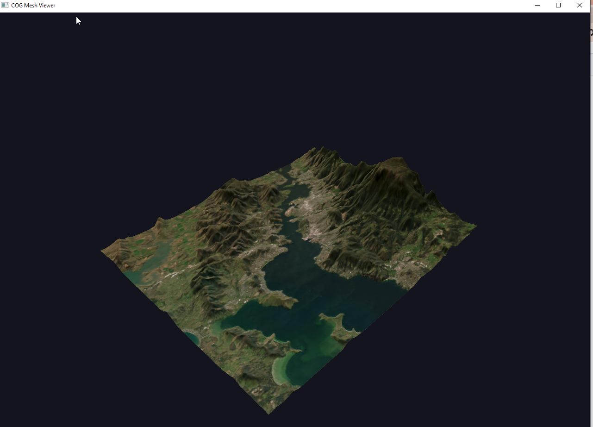

# COG Mesh Viewer — Status & Roadmap

## What we have

A single-file Python OpenGL viewer (`cog_mesh_viewer.py`) that renders 3D terrain from any pair of GDAL-readable sources:

- **DEM source** → mesh vertex elevations (read at ~1 pixel per vertex)
- **RGB source** → texture draped via barycentric interpolation (read at 4x mesh resolution)
- **Any CRS** for the mesh, sources read in their native CRS with bbox corner transforms only — no raster warping
- **Auto DEM** from Copernicus 30m COG tiles on AWS, with `/vsimem/` VRT mosaicking across tile boundaries
- **Default RGB** from Esri World Imagery WMTS

### Stack
- Python 3.12 (OSGeo4W on Windows)
- moderngl + glfw (OpenGL 3.3 core)
- osgeo.gdal + osgeo.osr
- numpy, pyrr

To install (only tried on Windows within OSGeo4W shell). Abandoned using uv because of different library details and GDAL package location. 

```bash
pip install uv
python -m pip install --upgrade pip
pip install uv
pip install moderngl glfw numpy pyrr
## sanity check
python -c "from osgeo import gdal; print(gdal.VersionInfo())"
## 3120100
```

### Controls
| Key | Action |
|-----|--------|
| Left-drag | Orbit |
| Right-drag | Pan |
| Scroll | Zoom |
| W | Toggle wireframe |
| T | Toggle texture / elevation colormap |
| Up/Down | Z exaggeration (1.2x per press) |
| Esc | Quit |

### CLI
```
python cog_mesh_viewer.py
python cog_mesh_viewer.py --bbox 149.8,-37.15,150.1,-36.9
python cog_mesh_viewer.py --crs EPSG:3577 --bbox-crs EPSG:4326
python cog_mesh_viewer.py --dem /path/to/dem.tif --rgb "WMTS:https://..."
python cog_mesh_viewer.py --rgb /vsicurl/https://example.com/image.tif
python cog_mesh_viewer.py --rgb none  # elevation colormap only
python cog_mesh_viewer.py --nx 256 --ny 256 --zscale 0.001
```

Any GDAL DSN works for `--dem` and `--rgb`: local files, `/vsicurl/`, `/vsis3/`, WMTS, VRT, etc.

### Key design decisions
- **No raster warping** — sources are read in their native CRS at native pixel alignment. Only bbox corners are transformed. The GPU handles the texture-to-mesh mapping via UV coordinates and barycentric interpolation.
- **GDAL overview selection** — `ReadAsArray` with `buf_xsize < src_xsize` automatically picks the best overview level. No manual overview management.
- **Unit-square mesh** — vertex positions in [0,1]² (aspect-corrected), with tex coords in [0,1]². This keeps the geometry simple and lets the bbox+CRS mapping stay external.

### Confirmed working combinations
- Default (Hobart, EPSG:4326, Copernicus DEM + WMTS imagery)
- Eden coast (clear coastline validation of DEM/texture alignment)
- 4-tile DEM mosaic via /vsimem/ VRT (wider Hobart region)
- EPSG:3577 mesh with --bbox-crs EPSG:4326
- EPSG:32755 mesh with Pawsey COG RGB + auto Copernicus DEM
- `GDAL_DISABLE_READDIR_ON_OPEN=EMPTY_DIR` for faster multi-tile /vsicurl/ loads

### Example

Here we have a scene in UTM, a bounding box in longlat (it's a baked in default for `--bbox`), an RGB in global Mercator (a baked in default, or use `--rgb`, and base DEM tiles in longlat (baked in default, or use `--dem`). 

```bash
python cog_mesh_viewer.py  --crs "EPSG:3577" --bbox-crs EPSG:4326
```

and the output, with guide to scene spec and controls, user arrows the scene z-exag. 

```
Bbox (input):  [147.2, -43.0, 147.5, -42.75] (EPSG:4326)
Bbox (mesh):   [1276284.3298944382, -4775673.179233108, 1304610.628539936, -4751969.961175133] (EPSG:3577)
Mesh: 128 x 128
  Auto DEM: /vsicurl/https://copernicus-dem-30m.s3.amazonaws.com/Copernicus_DSM_COG_10_S43_00_E147_00_DEM/Copernicus_DSM_COG_10_S43_00_E147_00_DEM.tif
Reading DEM: /vsicurl/https://copernicus-dem-30m.s3.amazonaws.com/Copernicus_DSM_COG_10_S43_00_E147_00_DEM/Copernicus_DSM_COG_10_S43_00_E147_00_DEM.tif
  Bbox in DEM CRS: ['147.20', '-43.00', '147.50', '-42.75']
  Elevation range: -0.0 to 1257.9
Reading RGB: WMTS:https://services.arcgisonline.com/arcgis/rest/services/World_Imagery/MapServer/WMTS/1.0.0/WMTSCapabilities.xml,layer=World_Imagery
  Texture: 512 x 512
  Z scale: 0.000238 (range 1257.9m -> 0.300 units)
  Aspect ratio: x=1.000, y=0.837

── Controls ──
  Left-drag:   orbit
  Right-drag:  pan
  Scroll:      zoom
  W:           toggle wireframe
  Up/Down:     z exaggeration
  T:           toggle texture / elevation colormap
  Esc:         quit

  Z exaggeration: 0.8x
  Z exaggeration: 0.7x
  Z exaggeration: 0.6x
```



---

## Short-term improvements

### Already discussed
- **Screenshot/export** — dump framebuffer to PNG or mesh to OBJ/PLY
- **Multiple RGB source toggle** — T cycling through a list of sources rather than just texture/colormap
- **Mesh resolution bump** — 256x256 or 512x512, overview selection handles it automatically
- **GTI catalog for Copernicus SRTM** - use GDAL GTI setup for the global SRTM dems, should be faster than dynamic VRT of local tiles (indexed globally)
- 
### Quick wins
- **Title bar info** — show CRS, bbox, mesh res, z-exag in the window title
- **Bbox from click** — right-click to print world coordinates of a mesh point
- **Nodata transparency** — alpha=0 for nodata pixels so ocean is background colour not black
- **Aspect ratio for non-geographic CRS** — current latitude correction is only for geographic; projected CRS with non-square pixels would need checking

---

## Big goals

### 1. Scale up bbox — rely on GDAL's multi-resolution decimation

**Question:** How large a bbox can we push while still getting usable imagery and DEM from overview reads?

The maths is straightforward: a 128x128 mesh means GDAL reads ~128 pixels in each axis from the source. For a Copernicus 30m DEM that's ~4km. Push to 512x512 mesh over a 1° bbox and you're reading ~250m effective resolution from the overviews. For WMTS sources the tile pyramid gives you the same behaviour.

**Approach:**
- Test progressively larger bboxes: 0.3° → 1° → 5° → continent
- Monitor: load time, visual quality, overview level actually selected
- The DEM auto-tile VRT already handles multi-tile mosaics
- WMTS scales inherently (it's a tile pyramid)
- For very large bboxes, COG overviews may run out of levels — at that point we'd need a lower-res global DEM (ETOPO, GEBCO)

### 2. View-dependent level of detail (LOD)

**Question:** Can the scene request the resolution it actually needs for the current view?

This is the ambitious one. Two sub-approaches:

**2a. Simple LOD (re-read on zoom):**
- Detect when camera distance crosses a threshold
- Re-read DEM and RGB at new resolution matching the viewport
- Rebuild vertex buffer and texture
- Cheap to implement, re-uses existing `read_cog_bbox` + `make_mesh`
- Visually: a noticeable pause + pop when LOD changes, but functional
- Could be async (read in background thread, swap buffers when ready)

**2b. Tile-based quadtree LOD (the real thing):**
- Subdivide the mesh bbox into a quadtree of tiles
- Each tile has its own mesh patch + texture at appropriate resolution
- Tiles near camera rendered at high detail, far tiles at low detail
- Tiles loaded/unloaded as camera moves
- This is essentially how Cesium/Google Earth work
- Significant complexity: tile management, seam stitching, async loading
- But the GDAL read path is identical — just many small `read_cog_bbox` calls

**2c. Hybrid — LOD for texture only, fixed mesh:**
- Keep mesh at a single resolution (sufficient for the DEM's contribution to shape)
- Swap texture resolution based on view — low-res texture when zoomed out, high-res when zoomed in
- Much simpler than full quadtree since only the texture changes
- The mesh never needs rebuilding
- GL texture swap is fast

### 3. Asymmetric resolution — high-res RGB, lower-res DEM

**Question:** Can we get a nice visual effect from more texture detail than mesh detail?

Yes — this is almost free with the current design. The texture is already at 4x mesh resolution. Push it further:

**Approach:**
- Mesh stays at 128x128 or 256x256 (sufficient for terrain shape)
- Texture goes to 1024x1024 or 2048x2048
- GPU's texture filtering handles the sub-triangle detail beautifully
- The visual effect: smooth terrain with sharp imagery — satellite photos of buildings/roads/fields clearly visible on gently undulating terrain
- Cost is GPU memory (a 2048x2048 RGB texture is ~12MB) and initial load time
- Could add `--tex-scale` argument (default 4, try 8 or 16)

This is probably the quickest path to a dramatic visual improvement and it validates the design principle that the mesh and texture are independent resolution concerns.

**Combined with goal 2c (texture LOD):** start with a low-res texture for fast load, then progressively fetch higher resolution as the scene is idle. The mesh doesn't change at all.

---

## Architecture notes for future work

The current single-file design is fine for now. If/when we add tile-based LOD or async loading, it would naturally split into:

```
cog_mesh_viewer/
  __main__.py      # CLI + render loop
  data.py          # GDAL read helpers, tile management
  mesh.py          # mesh generation, LOD
  camera.py        # orbit camera
  shaders.py       # GLSL sources
```

The key invariant to preserve: **data is always read in the source's native CRS and pixel grid**. The mesh defines the coordinate space, texcoords define the mapping, the GPU does the interpolation. No raster warping here (but that does also work well and probably for inherently target-tiled canvas i.e. [plumber-gdal-api](https://github.com/mdsumner/plumber-gdal-api/)).

Similar and much more production ready work like this in [deck.gl-raster](https://github.com/developmentseed/deck.gl-raster/), and older rgl approach to mesh mapping in [anglr](https://github.com/hypertidy/anglr/) and a to-be-updated [textures](https://github.com/hypertidy/textures/). Know of more examples, let us know please!  Teture mapping is an obvious technique but does the transfer through coordinate systems occur in many places? (An old commercial software Eonfusion did this heavily in the DirectX era). 


